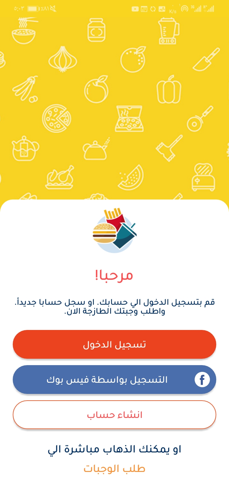
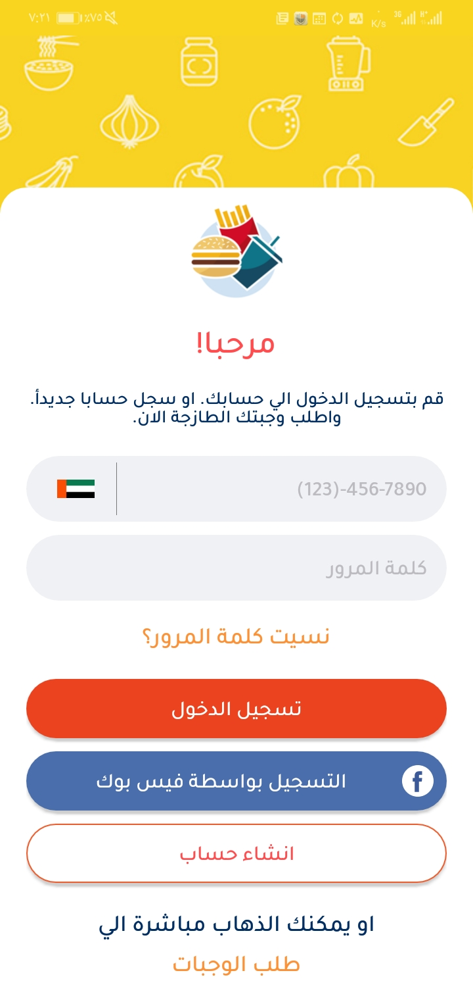
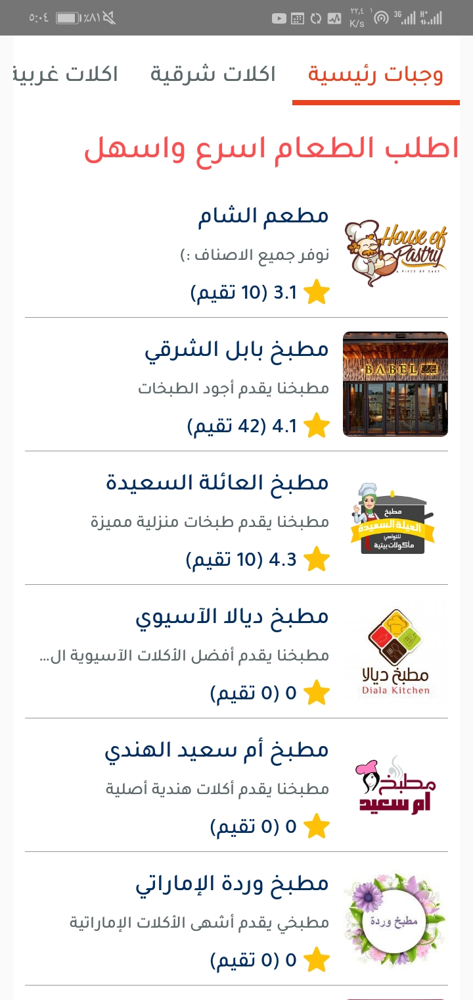
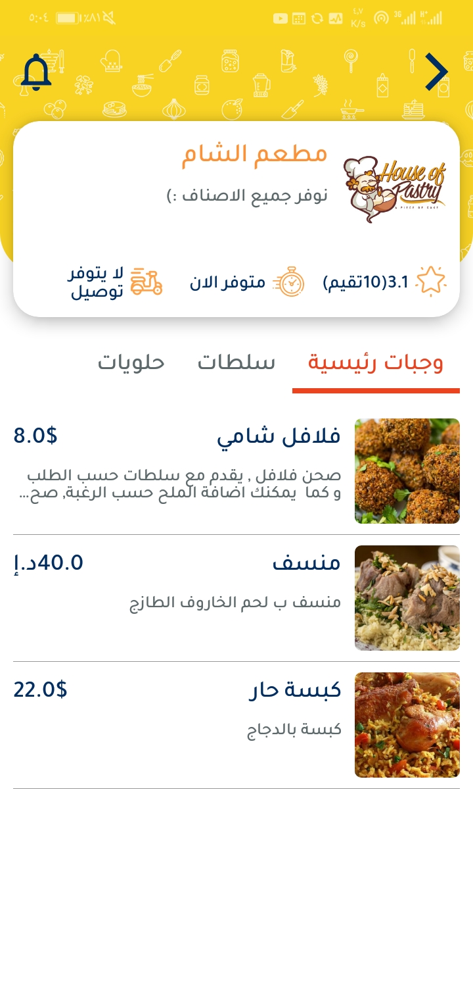
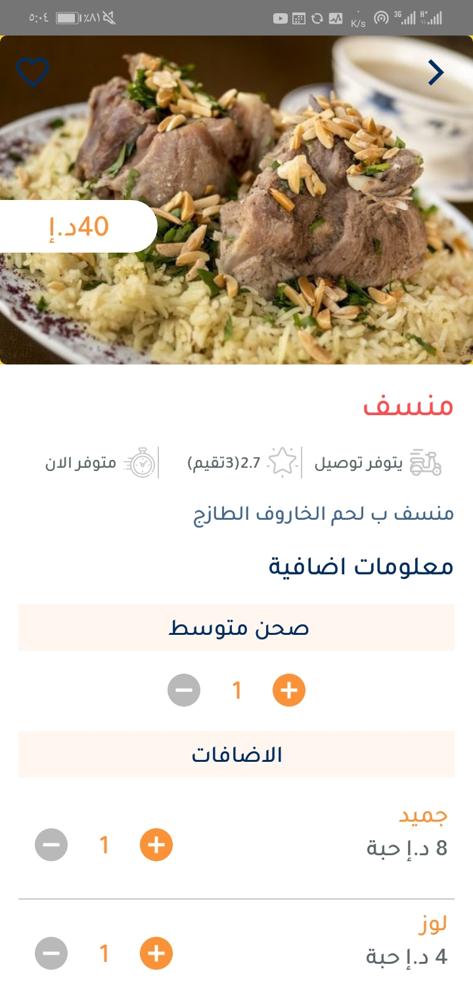
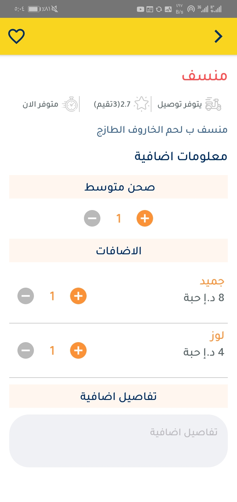

# Food Delivery
This project is a simplified food delivery app.

# Screenshots
<table>
	<tr><td></td>
	<td></td></tr>
	<tr><td></td>
	<td></td></tr>
	<tr><td></td>
	<td></td></tr>
</table>

# Features
- Using MVP Architecture
- Using DataBinding 
- Using DaggerHILT for Dependency Injection
- Using Retrofit to request api network
- Using Glide for loading image from url

# Libraries
- AndroidX.
- Android Data Binding.
- Dagger Hilt Android.
- Rxjava3.
- RxAndroid.
- Retrofit for REST api communication
- Glad for image loading
- Calligraphy for Custom font

### By Mohammed Khder
